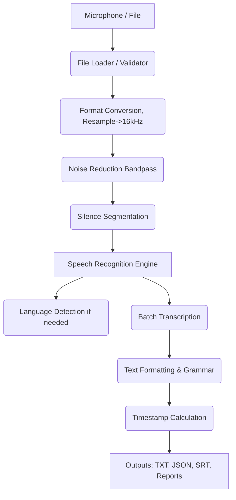

# System Design & Architecture

## Overview
The Voice-To-Text system is designed as a pipeline that processes an audio stream or file serially through a series of discrete modules. 

## Architectural Layers
1. **Input Layer**: `audio_input`
   - Handles `MicrophoneCapture` and `FileLoader`. Validates and converts incoming streams into `pydub.AudioSegment` models for processing.
2. **Preprocessing Layer**: `preprocessing`
   - Applies frequency filters (`HighPass`, `LowPass` out-of-bounds frequencies).
   - Segments via `pydub`'s `split_on_silence` function.
3. **Recognition Layer**: `recognition`
   - Bridges communication with APIs. 
   - Uses auto-routing strategies via `SpeechRecognizer` to point chunks towards either Google's Web APIs or local `Whisper` binary instances.
4. **Post-Processing Layer**: `postprocessing`
   - Combines semantic chunk arrays, capitalizes sentences, removes basic stop-words or fillers and applies `Timestamp` calculations to generate relative timing offsets (SRT headers).
5. **Output Layer**: `output`
   - Funnels final JSON trees and string templates into local file formats.

## Data Flow

